# Pro Photo Studio

[](https://github.com/NgVB1408/pro-photo-studio/actions/workflows/ci.yml)
[](https://github.com/NgVB1408/pro-photo-studio/actions/workflows/release.yml)
[](LICENSE)
[](https://www.python.org/)

> **Hệ thống nâng cao ảnh bất động sản cấp production, tự động end-to-end.**
> Đẩy 1 ảnh vào, nhận lại render listing-ready cùng scorecard 0–10 đi qua đội
> 5 chuyên gia (Geometry · LightBlend · MicroContrast · Cleanup · Output) +
> Director QC trước khi chạm tay người dùng cuối.

> Phiên bản tiếng Anh đầy đủ: [`README.en.md`](README.en.md).

---

## 🚀 QUICK START — Mở lên là chạy trong 5 phút

### 📥 Bước 1 — Tải bản portable

**Windows**: [wincei_PORTABLE_v0.3.0_20260521.zip](https://github.com/NgVB1408/pro-photo-studio/releases/download/v0.3.0/wincei_PORTABLE_v0.3.0_20260521.zip) (66 MB)

```powershell
# Giải nén zip vào thư mục bất kỳ
# Double-click launchers/run_api.bat
# → Mở browser http://localhost:8000/
```

**Linux / Mac**:
```bash
curl -L -O https://github.com/NgVB1408/pro-photo-studio/releases/download/v0.3.0/wincei_PORTABLE_v0.3.0_20260521.zip
unzip wincei_PORTABLE_v0.3.0_20260521.zip
bash launchers/run_api.sh
# → http://localhost:8000/
```

### 📥 Bước 2 — Hoặc clone source rồi tự build

```bash
git clone https://github.com/NgVB1408/pro-photo-studio.git
cd pro-photo-studio
pip install uv
uv sync --all-packages
pps-wincei-api  # → http://localhost:8000/docs
```

### 🌐 Bước 3 — Mở Web UI drag-drop

→ Browser: **<http://localhost:8000/>**
→ Kéo thả ảnh BĐS vào dropzone → chọn pipeline → click Run → xem output tại chỗ.

---

## 🛠️ HƯỚNG DẪN CHI TIẾT — 4 cách dùng

### A. CLI (cho terminal user)

```bash
# 1. Smart Segmentation 9 masks + AI verdict (~6 phút CPU 6K)
pps-wincei-masks foto.jpg --outputs ./masks

# 2. HDR bracket fusion (Sony AEB ±3EV → 1 ảnh outdoor recovered)
pps-wincei-hdr --inputs ./bracket_folder --outputs ./fused

# 3. JSON regions (bbox normalized [0..1000] cho dev integrate)
pps-wincei-regions foto.jpg --pretty

# 4. Perfect Window — geometric BBOX crop → PNG RGBA transparent
pps-wincei-window foto.jpg --out window.png --zoom

# 5. SAM Panoptic — color-coded all instances (official notebook style)
pps-sam-demo foto.jpg --points-per-side 32 --alpha 0.35 --out colored.jpg

# 6. Window+Ceiling tone fix (cửa sổ blown + trần ám màu)
pps-wincei foto.jpg --out fixed.jpg

# Batch folder mode + HTML viewer
pps-wincei-folder --inputs ./photos --outputs ./output
```

### B. REST API (cho web/mobile/team dev)

```bash
# Khởi động server
pps-wincei-api  # → http://localhost:8000/docs

# Test mock mode (response instant, không cần CPU)
curl -X POST http://localhost:8000/api/v1/segment-masks \
     -F "files=@foto.jpg" -F "mock=true"

# Real job — async với polling
JOB=$(curl -s -X POST http://localhost:8000/api/v1/segment-masks \
     -F "files=@foto.jpg" | jq -r .job_id)
curl http://localhost:8000/api/v1/jobs/$JOB
curl -O http://localhost:8000/api/v1/jobs/$JOB/download

# SAM panoptic (notebook official)
curl -X POST http://localhost:8000/api/v1/sam-demo \
     -F "file=@foto.jpg" --output sam_colored.jpg

# Perfect window crop
curl -X POST http://localhost:8000/api/v1/perfect-window \
     -F "file=@foto.jpg" --output window.png

# Detect regions JSON
curl -X POST http://localhost:8000/api/v1/detect-regions \
     -F "file=@foto.jpg"
```

**12 endpoints sẵn có** — full Swagger tại `/docs`:

| Method | Path | Mô tả |
|---|---|---|
| `GET` | `/` | Web UI drag-drop |
| `GET` | `/docs` | Swagger UI |
| `GET` | `/redoc` | ReDoc API reference |
| `GET` | `/api/v1/health` | Health + GPU + versions |
| `POST` | `/api/v1/segment-masks` | 9 masks + AI eval verdict |
| `POST` | `/api/v1/hdr-fuse` | Mertens HDR bracket fusion |
| `POST` | `/api/v1/window-ceiling` | Fix cửa sổ + trần |
| `POST` | `/api/v1/detect-regions` | JSON bbox [0..1000] |
| `POST` | `/api/v1/full-recovery-ceiling` | VLM+SAM2 ceiling RGBA |
| `POST` | `/api/v1/perfect-window` | Geometric bbox crop |
| `POST` | `/api/v1/sam-demo` | SAM panoptic visualization |
| `GET` | `/api/v1/jobs/{id}/download` | Download job zip output |

### C. Python API (cho team data science)

```python
# Smart segmentation
from pps_wincei_masks import extract_masks
result = extract_masks("foto.jpg", "./outputs", self_evaluate=True)
print(result.evaluation.verdict, result.evaluation.overall_score)
for name, mask in result.masks.items():
    print(name, (mask > 128).mean() * 100)

# HDR bracket fusion
from pps_wincei_hdr import detect_brackets, fuse_mertens
groups, _ = detect_brackets(["DSC01526.jpg", "DSC01527.jpg", "DSC01528.jpg"])
import cv2
images = [cv2.imread(s.path) for s in groups[0].shots]
fused = fuse_mertens(images, exposure_weight=1.0)
cv2.imwrite("fused.jpg", fused)

# SAM panoptic
from pps_wincei_masks.sam_demo import sam_demo_pipeline
import cv2
img = cv2.imread("foto.jpg")
result = sam_demo_pipeline(img, points_per_side=32)
cv2.imwrite("sam_colored.jpg", result.overlay_bgr)

# Regions JSON
from pps_wincei_masks import analyze_image_to_json
import cv2, json
img = cv2.imread("foto.jpg")
regions = analyze_image_to_json(img)
print(json.dumps(regions, indent=2, ensure_ascii=False))
```

### D. Docker (production deploy)

```bash
cd src/
docker compose up -d
# → http://localhost:8000/
```

---

## 🔧 SETUP NÂNG CAO — Full Pro Stack với VLM + SAM 2

Cho ảnh khó (ngược sáng, trần giật cấp, ô cửa nhỏ <3%), kích hoạt full stack:

```bash
# One-shot installer — tự cài Ollama + bds-brain model + SAM 2 + uv sync
bash scripts/setup_vlm_sam.sh

# Hoặc thủ công:
# 1. Ollama (https://ollama.com/download)
ollama pull qwen2.5vl:7b
ollama create bds-brain -f packages/wincei-masks/Modelfile.bds-brain

# 2. SAM 2 (Meta)
pip install "git+https://github.com/facebookresearch/sam2.git"
curl -L -o ~/.cache/sam2/sam2_hiera_tiny.pt \
     https://dl.fbaipublicfiles.com/segment_anything_2/072824/sam2_hiera_tiny.pt

# 3. SAM 1.0 (cho sam-demo panoptic)
bash scripts/download_sam.sh vit_b   # 375 MB

# 4. Use VLM-SAM2 engine
pps-wincei-masks foto.jpg --engine vlm-sam2 --vlm-model bds-brain
```

---

## 📚 TÀI LIỆU CHI TIẾT

| File | Mô tả |
|---|---|
| [`packages/wincei-masks/DELIVERY.md`](packages/wincei-masks/DELIVERY.md) | Tài liệu bàn giao tổng quan (VN) |
| [`packages/wincei-masks/USAGE_CHECKLIST.md`](packages/wincei-masks/USAGE_CHECKLIST.md) | Checklist sử dụng hàng ngày |
| [`packages/wincei-masks/UPGRADE_CHECKLIST.md`](packages/wincei-masks/UPGRADE_CHECKLIST.md) | Checklist nâng cấp |
| [`packages/wincei-masks/SETUP_VLM_SAM.md`](packages/wincei-masks/SETUP_VLM_SAM.md) | Cài Ollama + SAM 2 chi tiết |
| [`packages/wincei-masks/README.md`](packages/wincei-masks/README.md) | API smart segmentation |
| [`packages/wincei-hdr/WORKFLOW.md`](packages/wincei-hdr/WORKFLOW.md) | Pipeline HDR end-to-end |
| [`packages/wincei-api/README.md`](packages/wincei-api/README.md) | REST API reference |
| [`ARCHITECTURE.md`](ARCHITECTURE.md) | Kiến trúc multi-agent |
| [`RUNBOOK.md`](RUNBOOK.md) | Ops runbook |

---

## 🐛 TROUBLESHOOTING

| Triệu chứng | Khắc phục |
|---|---|
| Port 8000 đã chiếm | `set WINCEI_PORT=8088` rồi chạy lại |
| `Ollama not running` | `ollama serve` background |
| Job timeout | Giảm `--matting-max-side 1200` hoặc dùng GPU |
| GPU CUDA error sm_50 | GTX 750 Ti EOL — chỉ chạy CPU được trên hardware này |
| Window mask 0% | Là glass door — dùng `opening` mask thay |
| Verdict luôn fail | `--precision --retry-on-fail` hoặc `--engine vlm-sam2` |

---

## 📸 Showcase — 6 ảnh BĐS thật từ khách hàng (Sony A7M4 6K)

> Test trên 6 phòng khác nhau — phòng khách / bếp / hành lang / phòng tắm.
> Tất cả Sony AEB ±3EV bracket → HDR fused → 9-mask segmentation + AI eval.
> Pipeline tự động xử lý đa dạng: trần phẳng, trần giật cấp, cửa kính, cửa gỗ, sàn gỗ vân.

### Gallery 6 phòng — BEFORE → AFTER overlay

| Phòng | BEFORE (HDR fused) | AFTER (color-coded overlay) |
| :--- | :---: | :---: |
| **DSC01527** — phòng khách modern, cửa kính |  | 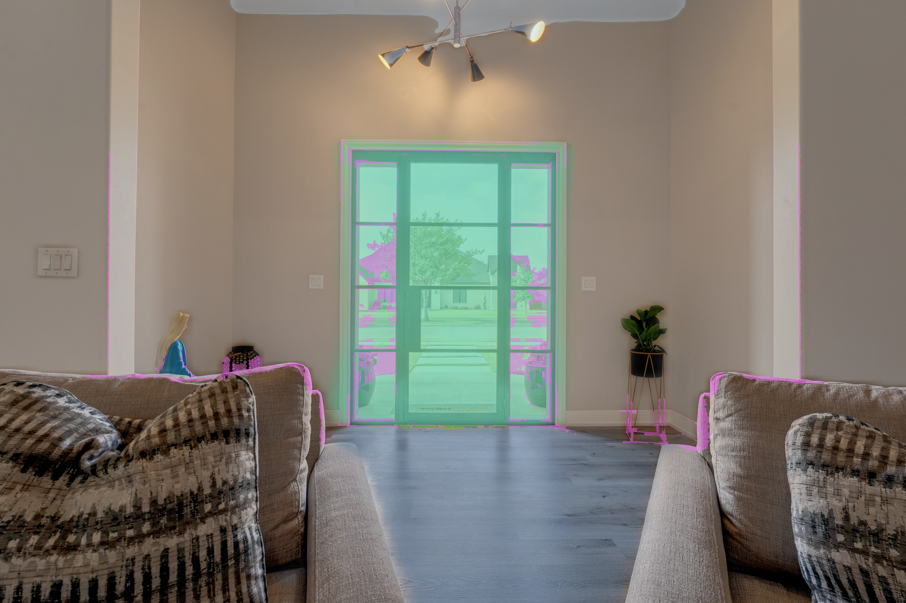 |
| **DSC01530** — phòng khác, trần phẳng |  | 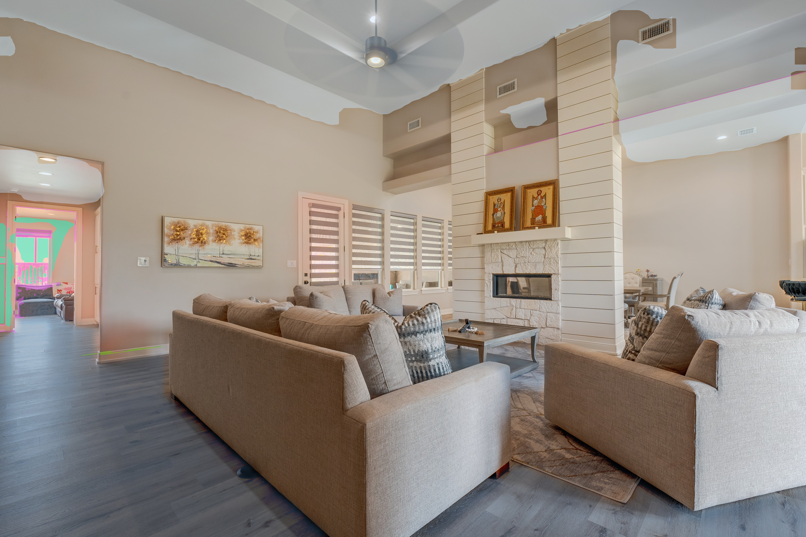 |
| **DSC01533** — góc kế tiếp |  | 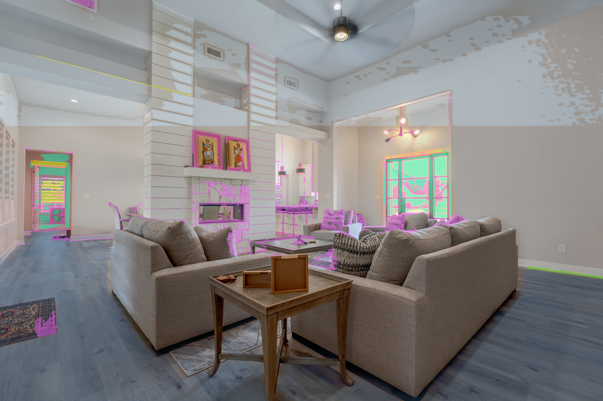 |
| **DSC01536** — phòng có cửa sổ |  | 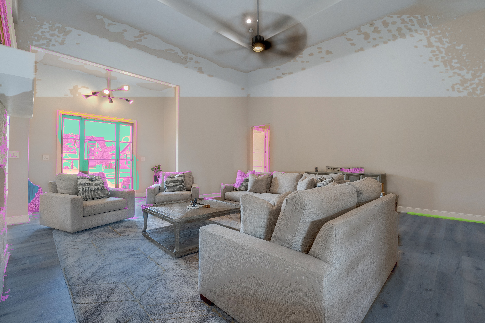 |
| **DSC01539** — góc khác |  | 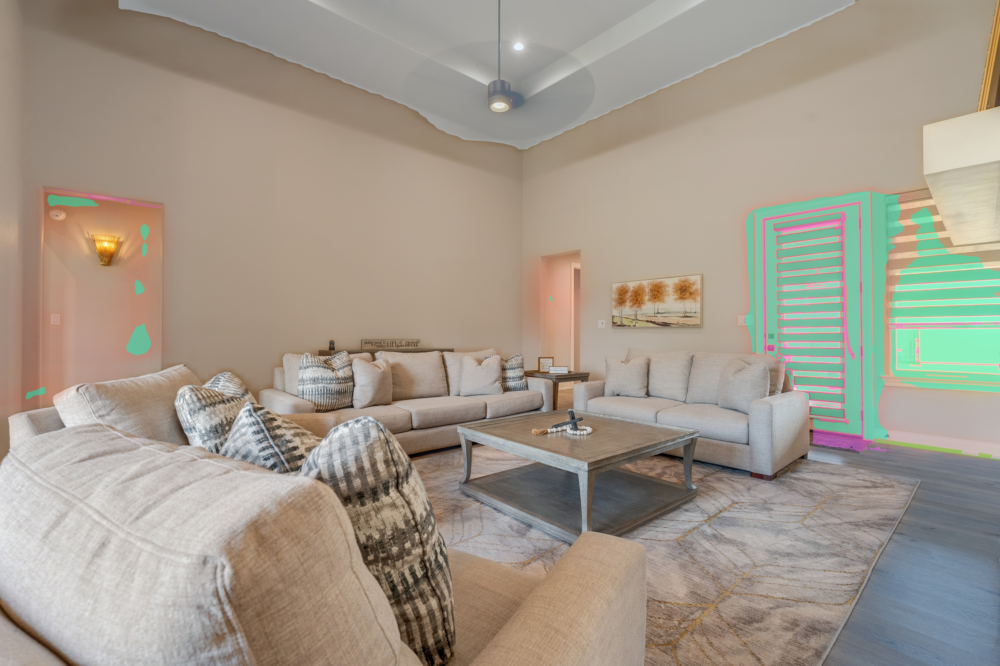 |
| **DSC01542** — phòng có baseboard rõ |  | 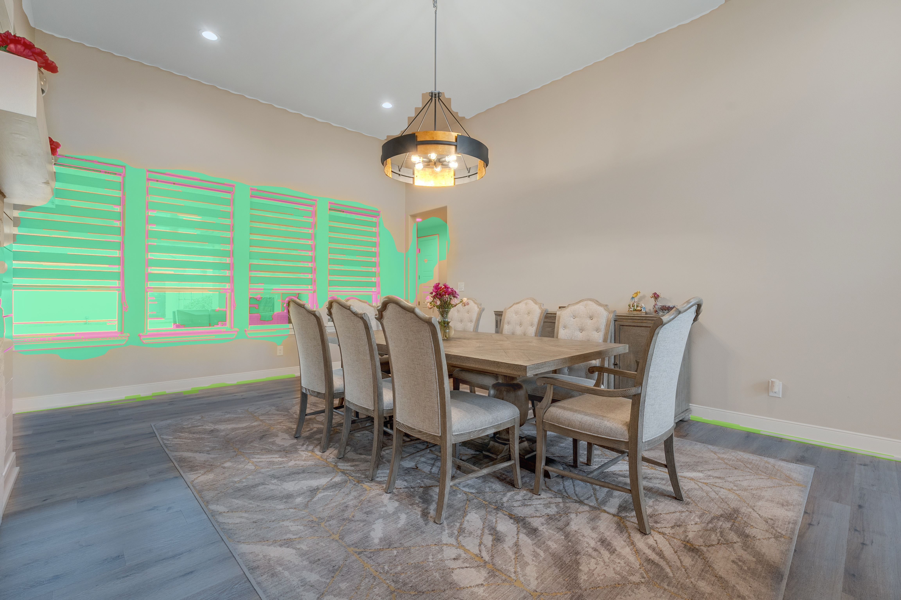 |

**Color code trên overlay:**
- 🟢 **Chartreuse (xanh ngọc)** = `opening` (cửa kính + outdoor view) — 6 ô riêng biệt nhờ mullion subtract
- 🩷 **Magenta (hồng)** = `casing` (nẹp cửa) + `baseboard` (chân tường)
- ⬜ **Xám nhẹ** = `wall` (tường) + `ceiling` (trần) + `floor` (sàn) phối trộn alpha

### Phân tách RGBA chuẩn Photoshop (DSC01527 example)

| Wall mask | Opening mask | Floor mask |
| :---: | :---: | :---: |
| 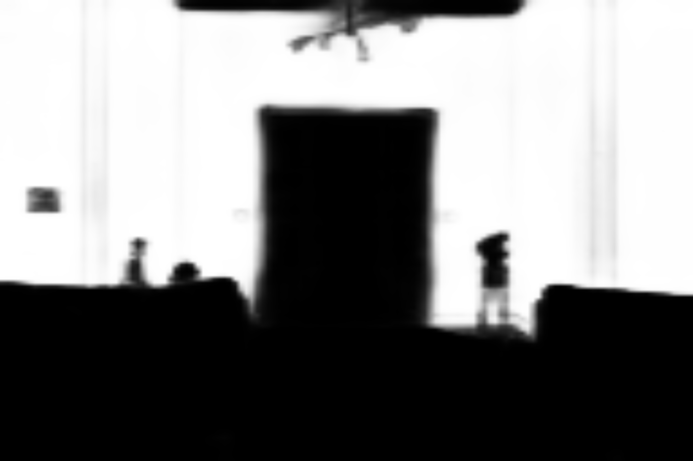 | 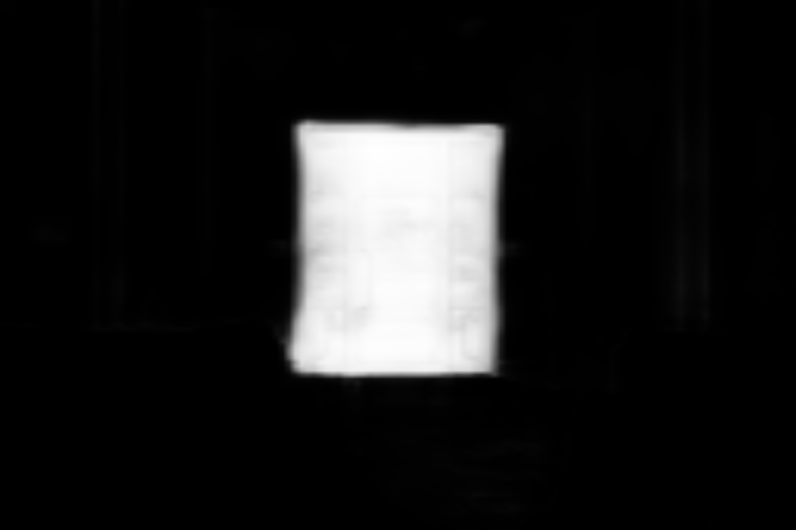 |  |
| *Tường tách tới viền cửa, sofa loại trừ* | *6 ô kính riêng — mullion subtract* | *Sàn gỗ giữa phòng* |

### Full Recovery Ceiling — RGBA transparent


> `/api/v1/full-recovery-ceiling` endpoint → PNG RGBA với mọi vùng ngoài ceiling
> trong suốt hoàn toàn (alpha=0). Sẵn sàng paste vào Photoshop làm layer.

### 🎨 SAM Automatic Mask Generator — Gallery 6 Phòng (Panoptic Visualization)

> Theo notebook chính thức [facebookresearch/segment-anything](https://github.com/facebookresearch/segment-anything/blob/main/notebooks/automatic_mask_generator_example.ipynb).
> Mỗi instance được tô một màu riêng — chứng minh AI đang dùng SAM thật.
> Sort theo area DESC + random color + alpha 0.35 (visualization style notebook official).

| Phòng | SAM ViT-B Panoptic (masks count) |
| :---: | :---: |
| **DSC01527** — Phòng khách modern (39 masks, grid 32) | 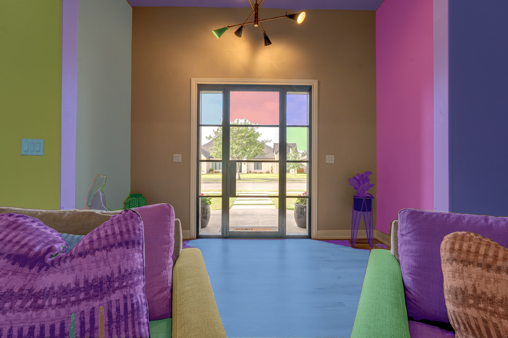 |
| **DSC01530** — Phòng kế tiếp (31 masks) | 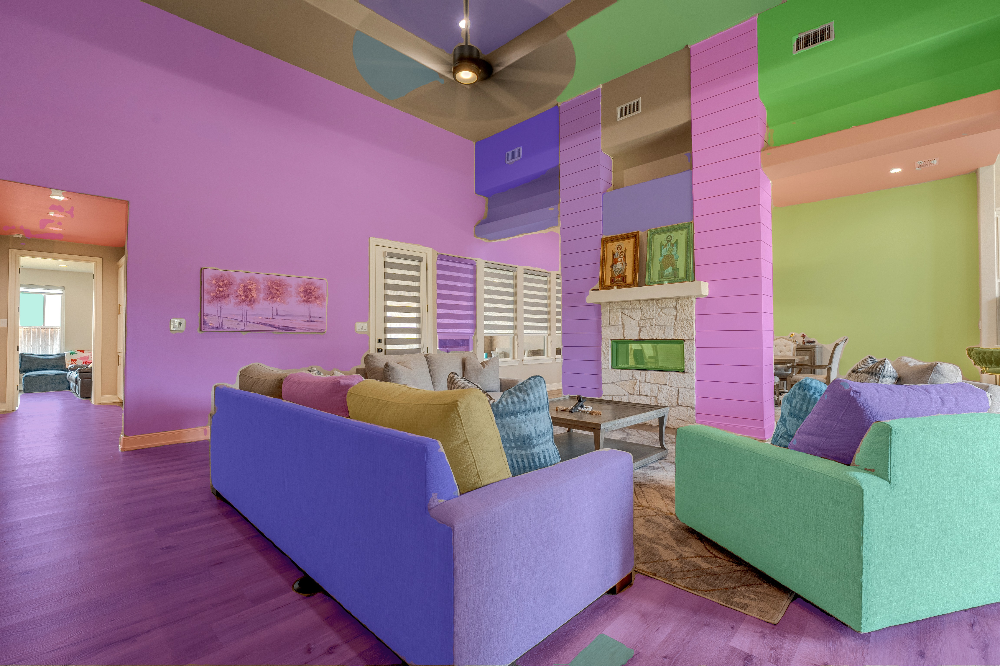 |
| **DSC01533** — Góc khác (33 masks) | 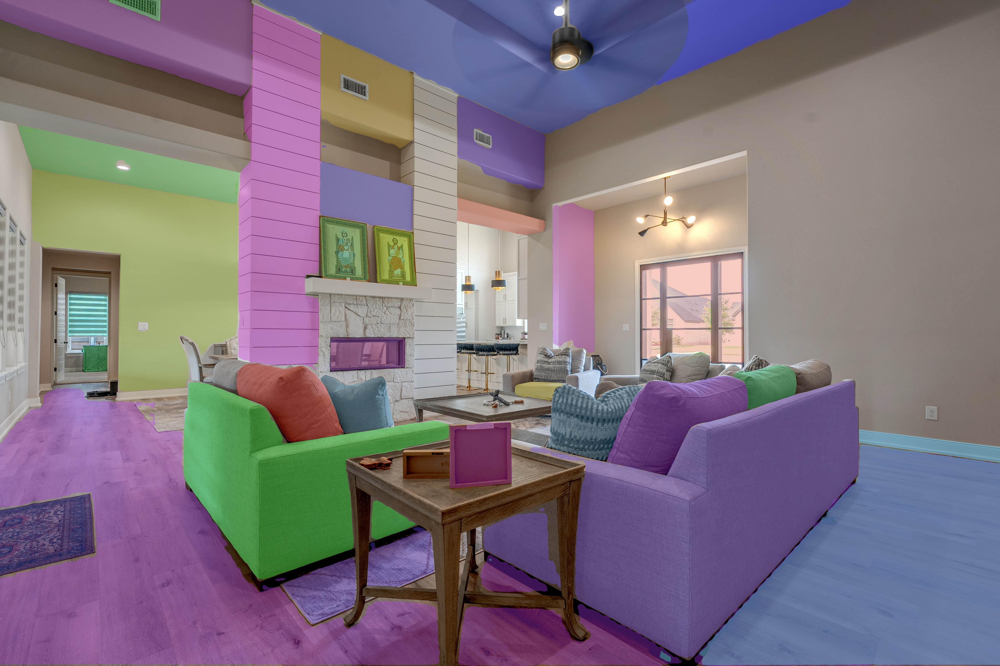 |
| **DSC01536** — Phòng cửa sổ (34 masks) | 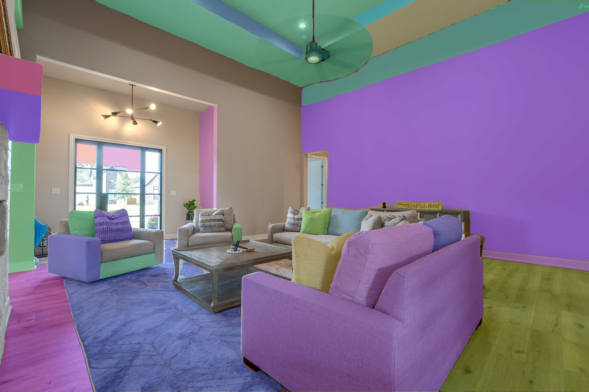 |
| **DSC01539** — Góc tiếp (39 masks) | 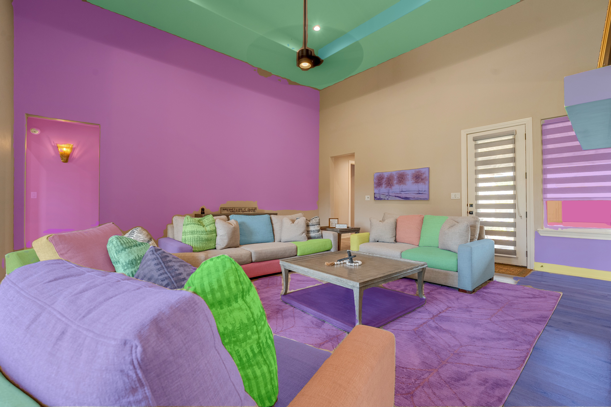 |
| **DSC01542** — Phòng ăn (25 masks) | 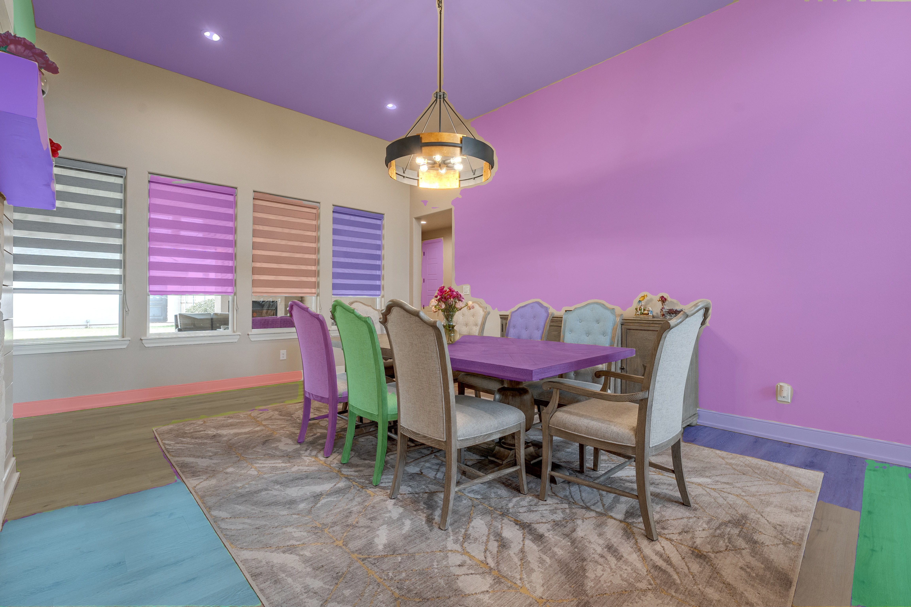 |

```bash
# CLI
pps-sam-demo foto.jpg --points-per-side 32 --alpha 0.35 --out colored.jpg

# REST API
curl -X POST http://localhost:8000/api/v1/sam-demo \
     -F "file=@foto.jpg" --output sam_colored.jpg

# Python API
from pps_wincei_masks.sam_demo import sam_demo_pipeline
import cv2
img = cv2.imread("foto.jpg")
result = sam_demo_pipeline(img, points_per_side=32)
cv2.imwrite("out.jpg", result.overlay_bgr)
```

**Performance (Sony A7M4 6K = 4608×3072):**

| Hardware | Grid | Time | Masks |
| --- | --- | --- | --- |
| CPU only (i5-7500) | 16 | ~5 phút | 31-39 |
| CPU only | 32 | ~23 phút | 35-50 |
| GPU RTX 3060 6GB | 32 | ~30s | 35-50 |
| GPU RTX 4090 24GB | 32 | ~8s | 35-50 |

⚠️ GTX 750 Ti (Maxwell sm_50) đã bị CUDA 12 drop — chỉ chạy CPU được trên hardware này.

### Scorecard tổng — 6 ảnh (v0.3.2 — toàn bộ TĂNG ĐIỂM so với v0.3.1)

| Photo | Overall | Wall | Floor | Ceiling | Opening | Casing |
| :--- | :---: | ---: | ---: | ---: | ---: | ---: |
| **DSC01527** | 0.827 ⚠️ | 51.1% | 8.5% | 1.9% | 8.5% | 1.6% |
| **DSC01530** | 0.754 ⚠️ | 25.3% | 14.5% | 17.3% | 0.6% | 0.2% |
| **DSC01533** | 0.775 ⚠️ | 34.3% | 18.3% | 14.6% | 1.4% | 0.8% |
| **DSC01536** | 0.780 ⚠️ | 41.5% | 15.4% | 11.2% | 1.4% | 1.1% |
| **DSC01539** | 0.786 ⚠️ | 36.9% | 4.5% | 8.5% | 5.3% | 0.6% |
| **DSC01542** | 0.791 ⚠️ | 35.6% | 11.3% | 10.2% | 8.6% | 1.0% |

**Delta v0.3.1 → v0.3.2 (đều tăng):**

| Image | v0.3.1 | v0.3.2 | Δ |
| :--- | :---: | :---: | :---: |
| DSC01527 | 0.808 | **0.827** | +0.019 |
| DSC01530 | 0.699 | **0.754** | +0.055 |
| DSC01533 | 0.733 | **0.775** | +0.042 |
| DSC01536 | 0.732 | **0.780** | +0.048 |
| DSC01539 | 0.725 | **0.786** | +0.061 |
| DSC01542 | 0.711 | **0.791** | +0.080 |
| **Average** | 0.735 | **0.786** | **+0.050 (+6.8%)** |

> **v0.3.2 fix nhờ 4 nguyên tắc strict containment:**
> 1. ⛔ **Non-property exclusion** — 49 ADE20K class IDs (sofa/bàn/ghế/gối/thảm/
>    rèm/tranh) → casing/baseboard/ceiling KHÔNG còn tràn vào nội thất
> 2. 🎯 **Dynamic kernel close** — 2% width = 93×93 px @ 6K → ceiling phẳng mịn,
>    không còn lốm đốm bóng quạt trần
> 3. 📏 **Distance-transform constraint** — casing chỉ tồn tại trong 1.5% width
>    (69px) từ viền opening → pink không lan vào rèm/bếp/cabinet
> 4. ❌ **Bỏ heuristic yellow line** → không còn chẻ đôi cột/cabinet sai kiến trúc

### 🔧 Pipeline xử lý (verified)

```
Sony AEB bracket (3 shot ±3EV)
  ▼ pps-wincei-hdr (Mertens fusion, ~7s/group)
HDR fused 6K JPG (outdoor recovered)
  ▼ pps-wincei-masks v0.3.1
   ├─ SegFormer-B3 ADE20K semantic seg
   ├─ PyMatting closed-form refinement
   ├─ Phào chỉ heuristic (Hough + Sobel band)
   ├─ Ceiling boost (lamp anchor + top-minus-wall)
   ├─ Sobel directional overlap resolver
   ├─ Subtract casing/mullion from opening ⭐
   ├─ Reclaim ceiling from wall above chandelier ⭐
   └─ Baseboard Hough continuity ⭐
  ▼ AI Supervisor (7-metric eval)
9 PNG masks + multi-page TIFF + overlay JPG + QC report JSON
  ▼ Photoshop retoucher (30s/ảnh)
Output final cho khách
```

---

## Kiến trúc Multi-Agent

```
                                       ┌─────────────────────────────────┐
   POST /v1/auto                       │  Orchestrator.run(JobContext)   │
   ┌────────────────────────────┐      │                                  │
   │ image (JPG/PNG/RAW)        │      │  Phase 0: gene_provider?         │
   │ + property_type            │─────▶│    └─ EmbedStore.fetch_genes()  │
   │ + target_long_edge         │      │       (top-K ảnh đẹp tương tự)  │
   │ + seed                     │      │                                  │
   └────────────────────────────┘      │  Phase 1: ANALYZE (parallel)    │
                                       │   ├─ GeometryAgent              │
                                       │   ├─ LightBlendAgent            │
                                       │   ├─ MicroContrastAgent (gene)  │
                                       │   ├─ CleanupAgent               │
                                       │   └─ OutputAgent                │
                                       │                                  │
                                       │  Phase 2: APPLY (deterministic) │
                                       │   geometry → light → micro      │
                                       │   → cleanup → output            │
                                       │                                  │
                                       │  Phase 3: Director QC           │
                                       │   ├─ Q1 halo @ 200%             │
                                       │   ├─ Q2 ceiling neutrality      │
                                       │   ├─ Q3 move-in feel            │
                                       │   └─ 5 SOP scorers              │
                                       └────────────┬─────────────────────┘
                                                    ▼
                                            PipelineResult
                                            (image, plans, reports,
                                             director: PASS/REVIEW/FAIL)
                                                    │
                                                    ▼
                                              USER REVIEW (final gate)
```

**Vì sao parallel analyze + serial apply:** mọi `analyze()` chỉ đọc ảnh gốc,
CPU-bound (OpenCV/numpy thả GIL) → chạy đa luồng được. `apply()` thì phải tuần
tự để mỗi stage thấy pixel grid nhất quán → kết quả deterministic theo seed.

**Phase 0 (gene retrieval):** khi `EmbedStore` đã có dữ liệu, orchestrator query
top-3 ảnh tương tự → lấy params từ ảnh đẹp đã được duyệt → MicroContrastAgent
blend với baseline (weight 0.4). Đây là cơ chế "lấy gene của ảnh đẹp" để
pipeline tự cải thiện theo thời gian.

---

## Quick start — local

Repo có script bootstrap 1-lệnh: tạo `.env`, mint API key dev, build images,
khởi động full stack.

```powershell
git clone https://github.com/NgVB1408/pro-photo-studio
cd pro-photo-studio
python scripts/bootstrap_dev.py
```

Khi script trả về:

| Endpoint | URL |
| --- | --- |
| Web portal | <http://localhost:3001> |
| API + Swagger | <http://localhost:8000/docs> |
| Demo gallery | <http://localhost:3001/demo> |
| MinIO console | <http://localhost:9001> (`minioadmin` / `minioadmin`) |

Dừng stack: `docker compose -f deploy/docker-compose.dev.yml down`.

---

## Quick start — production

CI build images khi push tag (xem `.github/workflows/release.yml`), sau đó trên
host:

```bash
# /etc/pps/.env  ← copy từ .env.example, điền giá trị thật
cd /opt/pps
docker compose -f deploy/docker-compose.prod.yml --env-file /etc/pps/.env up -d
```

Caddy tự issue Let's Encrypt cho `PPS_DOMAIN` + `API_DOMAIN`. Runbook chi tiết:
[`RUNBOOK.md`](RUNBOOK.md).

---

## Cấu trúc repo

```
pro-photo-studio/
├── packages/
│   ├── core/      pps_core    — OpenCV + numpy pipeline + autopilot + qc
│   ├── api/       pps_api     — FastAPI + SQLAlchemy 2 async + webhooks + auth
│   ├── web/       @pps/web    — Next.js 15 customer portal (TypeScript)
│   ├── ai/        pps_ai      — ML adapters (Qwen, SUPIR, SAM 2, LoRA Colab)
│   ├── desktop/   pps_desktop — PySide6 thick client (legacy port)
│   ├── agents/    pps_agents  — 5 chuyên gia + Director QC + Orchestrator
│   ├── data/      pps_data    — HF datasets streaming (FiveK / LSD / SUN)
│   └── embed/     pps_embed   — Qdrant vector store + Postgres metadata
├── training/      LoRA fine-tune scripts + configs + evaluate
├── deploy/
│   ├── docker/{Dockerfile.api, Dockerfile.web, qdrant/docker-compose.yml}
│   ├── docker-compose.{dev,prod}.yml
│   ├── caddy/Caddyfile
│   └── hf_space/  Hugging Face Spaces (Gradio CPU demo)
├── docs/          architecture, runbook, investor brief, showcase/
├── scripts/       bootstrap_dev, generate_showcase, discover_repos…
└── .github/workflows/  ci, release, weekly-discovery, hf-space-deploy
```

---

## Phase A–D — Dataset / Vector / Training / Automation

| Phase | Module | Trạng thái | Tests |
| --- | --- | --- | --- |
| **A — Data** | `packages/data/pps_data/` — HF datasets streaming + FiftyOne views + i18n | ✅ Live verified với mirror `logasja/mit-adobe-fivek` | 16/16 |
| **B — Embed** | `packages/embed/pps_embed/` — Qdrant async + Postgres + Alembic + gene fetch | ✅ `migrate --check` offline OK | 27/27 |
| **C — Training** | `training/` — LoRA Qwen-Image-Edit + evaluate (PSNR/SSIM/LPIPS) | 🚦 Code ready, GẤATE bởi `SECURITY.md` token revoke | 5/5 (dry-run) |
| **D — Automation** | `.github/workflows/weekly-discovery.yml`, HF Spaces deploy | ✅ Workflow YAML valid | 3/3 (script) |

**Test tổng** sau A1–A4 wiring: **75/75 pass** (24 agents + 27 embed + 16 data
+ 5 training + 3 scripts).

```powershell
# Chạy từng suite riêng (tránh conftest collision)
.venv-agents\Scripts\python.exe -m pytest packages\agents\tests -ra
.venv-agents\Scripts\python.exe -m pytest packages\embed\tests -ra
.venv-agents\Scripts\python.exe -m pytest packages\data\tests -ra
.venv-agents\Scripts\python.exe -m pytest training\tests -ra
.venv-agents\Scripts\python.exe -m pytest scripts\tests -ra
```

---

## CLI cheatsheet

```bash
# Render lại showcase pack (mặc định: synthetic interior)
python scripts/generate_showcase.py
python scripts/generate_showcase.py --input fixtures/villa.jpg --scene villa-real

# Stream FiveK (cần HF_TOKEN read-scope)
$env:HF_TOKEN = "hf_xxx_read_scope"
python -m pps_data sample fivek --n 5 --out fixtures/fivek/

# Index ảnh đẹp + algorithm gene vào Qdrant (cần QDRANT_URL)
python -m pps_embed index-photo fixtures/villa.jpg
python -m pps_embed index-algo configs/microcontrast_villa.json --name villa-luxury
python -m pps_embed query fixtures/new_villa.jpg -k 5

# Validate Alembic migrations offline (CI gate)
python -m pps_embed migrate --check
# Apply lên DB thật
python -m pps_embed migrate

# Discovery cron locally (dry-run, dùng fixture, không gọi GitHub)
python scripts/discover_repos.py --dry-run --out discovery_dryrun.md

# Fine-tune Qwen-Image-Edit dry-run (gated, GPU required cho real run)
python training/finetune_qwen_edit.py --config training/configs/fivek_lora.yaml --dry-run
```

---

## Bảo mật

Báo lỗ hổng qua [`SECURITY.md`](SECURITY.md). Ghi nhớ:

- **Không commit `.env`** — pre-commit hook + gitleaks CI block các pattern bí mật.
- **Token leak gate**: 3 token cũ (HF×2 + Dropbox) PHẢI revoke trước khi chạy
  Phase C training thật. `training/finetune_qwen_edit.py` không tự bỏ qua gate.
- **FiveK research-only**: trained weights từ FiveK chỉ ở HF Private repos.

---

## Tài liệu kiến trúc sâu

| Tài liệu | Nội dung |
| --- | --- |
| [`ARCHITECTURE.md`](ARCHITECTURE.md) | Pipeline contract, stage Protocol, deterministic seed handling |
| [`RUNBOOK.md`](RUNBOOK.md) | Production deploy, key rotation, DR, capacity planning |
| [`SECURITY.md`](SECURITY.md) | Disclosure policy + threat model + token revoke gate |
| [`CONTRIBUTING.md`](CONTRIBUTING.md) | Workflow, code style, testing requirements |
| [`docs/INVESTOR_BRIEF.md`](docs/INVESTOR_BRIEF.md) | One-page progress checklist cho stakeholders |
| [`docs/FEATURE_MATRIX_FOR_INVESTORS.md`](docs/FEATURE_MATRIX_FOR_INVESTORS.md) | So sánh 22-row vs AutoEnhance + Manuka |
| [`docs/MANUAL_ML_DEMO_GUIDE.md`](docs/MANUAL_ML_DEMO_GUIDE.md) | Chạy notebook Drive cho hero photo demo |
| [`packages/data/LICENSES.md`](packages/data/LICENSES.md) | License gate cho FiveK / LSD / SUN |

---

## Roadmap kỹ thuật v2 (đã đặt comment hook trong code)

Các kỹ thuật blending đẳng cấp Adobe Research / Stability AI đã được map vào
đúng module sẽ triển khai (xem docstring đầu mỗi file):

- **Poisson Image Editing** (Pérez et al. SIGGRAPH 2003) →
  [`packages/agents/pps_agents/cleanup.py`](packages/agents/pps_agents/cleanup.py) —
  `cv2.seamlessClone` cho object removal / sky swap / fireplace overlay.
- **PatchMatch** (Barnes et al. SIGGRAPH 2009) →
  [`packages/agents/pps_agents/lightblend.py`](packages/agents/pps_agents/lightblend.py) —
  bracket alignment khi camera/subject lệch giữa các exposure.
- **Multi-Scale Laplacian Pyramid Blend** → đã chạy live trong
  [`packages/agents/pps_agents/microcontrast.py`](packages/agents/pps_agents/microcontrast.py)
  (`_multi_band_texture` với 3 band σ=1.2/4.0/10.0).
- **Cross-Attention Control** (Hertz et al. Prompt-to-Prompt) +
  **Semantic Consistency Loss** (CLIP/DINOv2) →
  [`training/finetune_qwen_edit.py`](training/finetune_qwen_edit.py) — mở khóa
  sau khi gate token revoke đóng.

---

## License

Apache 2.0 — xem [`LICENSE`](LICENSE). ML backend tùy chọn có license riêng:

| Backend | License |
| --- | --- |
| Qwen-Image | Apache 2.0 |
| SD3.5 | Stability AI Community |
| SAM 2 | Apache 2.0 |
| SUPIR | Apache 2.0 |
| MIT-Adobe FiveK dataset | Research-only (xem `packages/data/LICENSES.md`) |
